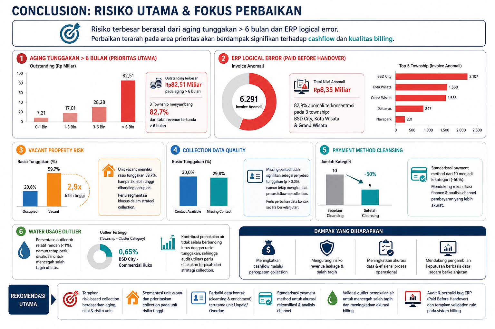
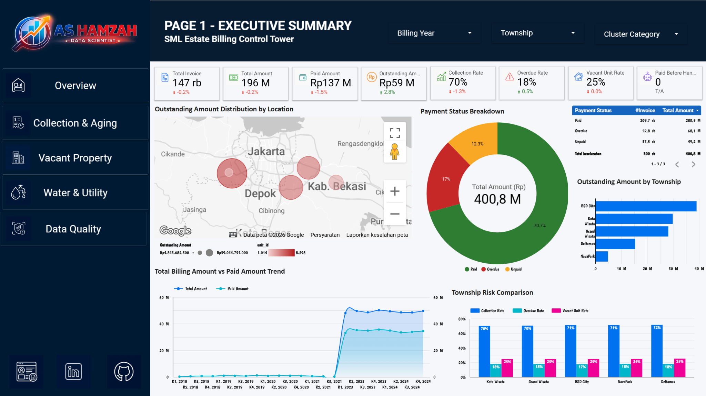
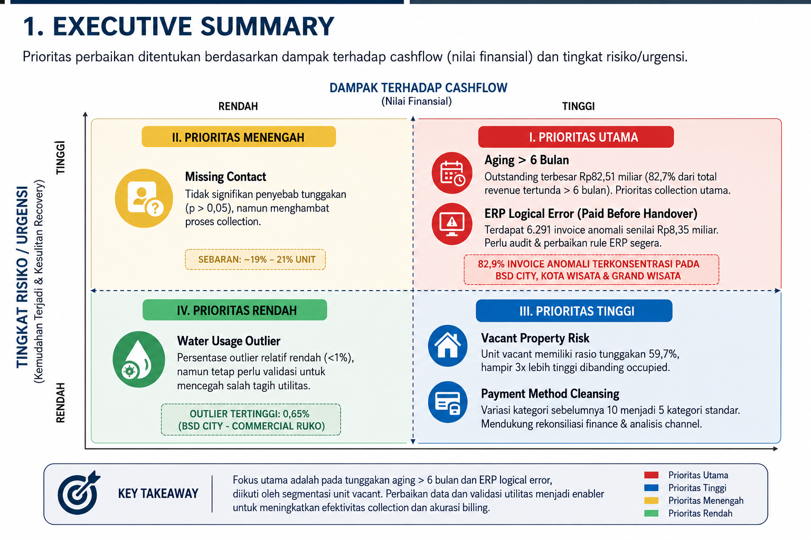

# Revenue Leakage & Billing Control Tower Analysis

## SML Township Management 2021–2024



Project ini menganalisis data billing estate township untuk mengidentifikasi **revenue leakage**, risiko collection, isu kualitas data, anomali billing utilitas, dan logical error pada sistem ERP. Analisis ini mendukung pendekatan **billing control tower** untuk meningkatkan visibilitas cashflow, efektivitas collection, akurasi billing, dan kontrol operasional.

---

## Disclaimer Data

Project ini merupakan **kasus fiktif** yang dibuat untuk tujuan pembelajaran dan portfolio data analyst. Data yang digunakan adalah **data dummy/simulasi**, bukan data operasional asli perusahaan. Seluruh nama entitas, struktur data, nilai transaksi, dan insight yang ditampilkan digunakan sebagai bahan latihan analisis, visualisasi, dashboarding, dan data storytelling.

Analisis ini tidak merepresentasikan kondisi aktual Sinarmas Land maupun entitas bisnis terkait.

---

## Gambaran Project

Revenue township management dapat terdampak oleh invoice IPL yang belum dibayar, overdue receivables, unit vacant, data kontak pemilik yang tidak lengkap, pencatatan payment method yang tidak konsisten, outlier pemakaian air, serta anomali pada sistem ERP.

Project ini berfokus untuk mengidentifikasi risiko billing dan collection yang paling kritikal, lalu menerjemahkan hasil analisis menjadi rekomendasi yang actionable untuk **risk-based collection**, **validasi billing**, dan **perbaikan kualitas data**.

---

## Struktur Repository

```text
.
├── README.md
├── SML_Estate_Billing_Control_Tower_Analysis.ipynb
│
├── images/
│   ├── dashboard_preview.png
│   ├── executive_summary.png
│   └── key_visual.png
│
├── presentation/
│   └── SML_Estate_Billing_Control_Tower_Analysis.pdf
│
└── requirements.txt
```

### Deskripsi File

| File / Folder | Deskripsi |
|---|---|
| `README.md` | Dokumentasi project, konteks bisnis, key findings, rekomendasi, dan resource link |
| `SML_Estate_Billing_Control_Tower_Analysis.ipynb` | Notebook utama berisi data cleaning, analisis, visualisasi, dan insight generation |
| `images/dashboard_preview.png` | Preview dashboard untuk dokumentasi portfolio |
| `images/executive_summary.png` | Visual executive summary untuk merangkum area prioritas |
| `images/key_visual.png` | Visual utama yang menggambarkan conclusion, risiko, dan fokus perbaikan |
| `presentation/SML_Estate_Billing_Control_Tower_Analysis.pdf` | Final presentation deck dalam format PDF |
| `requirements.txt` | Daftar library Python yang digunakan dalam analisis |

---

## Business Objectives

Tujuan utama project ini adalah:

- Mengidentifikasi revenue leakage dari billing IPL yang berstatus unpaid dan overdue.
- Menganalisis aging schedule untuk menentukan outstanding receivables dengan risiko tertinggi.
- Mengevaluasi risiko unit vacant dan hubungannya dengan tunggakan billing.
- Menilai kualitas data collection melalui analisis missing contact number.
- Menstandarisasi kategori payment method untuk mendukung rekonsiliasi finance.
- Mendeteksi extreme water usage outlier yang dapat mengindikasikan masalah utility billing.
- Mengidentifikasi logical error pada ERP, terutama invoice paid yang tercatat sebelum handover date.
- Memberikan rekomendasi actionable untuk risk-based collection dan billing control.

---

## Dataset Overview

Analisis menggunakan data estate billing dari BigQuery dengan periode **2021–2024** dan jumlah data sekitar **300.000 records**.

Tabel sumber utama:

| Tabel | Deskripsi |
|---|---|
| `clusters` | Informasi township dan cluster |
| `units` | Informasi unit, owner, contact number, vacant status, dan handover date |
| `IPL billings` | Informasi invoice, billing amount, water usage, payment status, payment method, dan payment date |

Output clean data:

| Item | Value |
|---|---|
| Dataset | `SML_clean` |
| Table | `SML_data` |
| Analysis Tool | Google Colab / Python |
| Data Warehouse | BigQuery |
| Visualization Tool | Looker Studio |

> Catatan: Data yang digunakan dalam project ini merupakan data dummy/simulasi untuk pembelajaran. Dataset asli tidak disertakan dalam repository ini. Notebook berisi workflow analisis dan metodologi yang digunakan.

---

## Methodology

Workflow project terdiri dari lima tahap utama:

1. **Data Source**  
   Mengambil raw tables dari BigQuery: clusters, units, dan IPL billings.

2. **Data Integration & Cleaning**  
   Menggabungkan dataset, formatting kolom tanggal, handling missing values, duplicate check, standardisasi payment method, dan pembuatan anomaly flag.

3. **Data Analysis**  
   Melakukan exploratory data analysis, revenue leakage analysis, aging analysis, vacant risk analysis, collection data quality analysis, water outlier detection, dan Chi-Square Test.

4. **Clean Data Export**  
   Mengekspor clean dataset kembali ke BigQuery sebagai `SML_clean.SML_data`.

5. **Data Visualization**  
   Membangun dashboard Looker Studio untuk executive overview, collection & aging, vacant property risk, water & utility, dan data quality monitoring.

---

## Dashboard Preview



---

## Executive Summary Visual



---

## Key Analysis Areas

### 1. Revenue Leakage

Revenue leakage diukur melalui rasio billing amount yang berstatus unpaid dan overdue. Rasio tunggakan relatif mirip antar township, yaitu sekitar **28,5% hingga 29,9%**. Hal ini menunjukkan bahwa risiko collection bersifat sistemik di seluruh township, bukan hanya terjadi pada satu area tertentu.

### 2. Aging Schedule

Analisis aging menunjukkan bahwa outstanding terbesar terkonsentrasi pada invoice dengan aging lebih dari 6 bulan. Outstanding pada bucket `> 6 months` mencapai sekitar **Rp82,51 miliar**. BSD City, Kota Wisata, dan Grand Wisata menyumbang sekitar **82,7%** dari total revenue tertunda lebih dari 6 bulan, sehingga menjadi prioritas utama untuk collection recovery.

### 3. Vacant Property Risk

Unit vacant memiliki rasio tunggakan jauh lebih tinggi dibanding unit occupied. Rasio tunggakan unit vacant mencapai **59,7%**, hampir 3 kali lebih tinggi dibanding occupied. Chi-Square Test menunjukkan hubungan signifikan antara occupancy status dan status tunggakan dengan **p < 0,01**.

### 4. Collection Data Quality

Missing contact number tidak terbukti signifikan secara statistik sebagai penyebab langsung tunggakan, dengan **p > 0,05**. Namun, missing contact tetap menjadi hambatan operasional karena membatasi kemampuan tim collection untuk melakukan follow-up kepada pemilik unit. Missing contact tersebar relatif merata antar township, yaitu sekitar **19%–21%**.

### 5. Payment Method Cleansing

Data payment method sebelumnya tidak konsisten karena terdapat beberapa variasi penulisan untuk channel pembayaran yang sama. Proses cleansing mengurangi kategori payment method dari **10 kategori menjadi 5 kategori standar**, sehingga analisis channel pembayaran dan rekonsiliasi finance menjadi lebih konsisten. Namun, nilai payment method yang tercatat sebagai `None` tetap perlu menjadi perhatian.

### 6. Water Usage Outlier

Extreme water usage outlier relatif rendah, yaitu kurang dari **1%**, tetapi tetap perlu divalidasi karena dapat menyebabkan ketidakakuratan billing utilitas. Outlier tertinggi ditemukan pada **BSD City - Commercial Ruko**, yaitu sekitar **0,65%**.

### 7. ERP Logical Error

Analisis ERP logical error mengidentifikasi invoice dengan status `Paid` tetapi memiliki `payment_date` lebih awal daripada `handover_date`. Kondisi ini mengindikasikan potensi billing logic issue, data migration issue, atau kesalahan mapping tanggal. Analisis menemukan **6.291 invoice anomali** dengan total nilai sekitar **Rp8,35 miliar**. Sekitar **82,9%** invoice anomali terkonsentrasi pada BSD City, Kota Wisata, dan Grand Wisata.

---

## Key Findings

| Area | Key Finding | Business Impact |
|---|---|---|
| Revenue Leakage | Rasio tunggakan relatif mirip antar township | Masalah collection bersifat sistemik |
| Aging Schedule | Outstanding >6 bulan mencapai Rp82,51 miliar | Risiko recovery tinggi dan cashflow tertunda |
| Vacant Property | Rasio tunggakan unit vacant mencapai 59,7% | Unit vacant membutuhkan strategi collection khusus |
| Collection Data Quality | Missing contact tidak signifikan secara statistik, tetapi menghambat follow-up | Proses collection menjadi lebih lambat |
| Payment Method | Kategori turun dari 10 menjadi 5 | Rekonsiliasi dan analisis channel lebih konsisten |
| Water Usage Outlier | Outlier rendah, tetapi tetap perlu validasi | Mencegah kesalahan billing utilitas |
| ERP Logical Error | 6.291 invoice paid before handover senilai Rp8,35 miliar | Risiko audit finding dan salah pencatatan revenue |

---

## Recommendations

- Terapkan **risk-based collection** berdasarkan aging, outstanding amount, vacant status, dan contact availability.
- Prioritaskan collection pada **BSD City, Kota Wisata, dan Grand Wisata**, terutama untuk invoice dengan aging lebih dari 6 bulan.
- Buat segment khusus untuk **unit vacant**, terutama unit vacant dengan status unpaid/overdue.
- Lakukan cleansing contact number secara berkala, khususnya pada unit dengan kombinasi **Missing Contact + Unpaid/Overdue**.
- Standarisasi data payment method dan monitor nilai `None` untuk mendukung rekonsiliasi finance.
- Validasi extreme water usage sebelum invoice diterbitkan untuk mengurangi risiko kesalahan billing utilitas.
- Terapkan ERP validation rule agar `payment_date` tidak boleh lebih awal dari `handover_date` untuk invoice aktif.
- Bangun monitoring billing control secara berkelanjutan melalui dashboard Looker Studio.

---

## Dashboard & Presentation

| Resource | Link |
|---|---|
| Looker Studio Dashboard | [Open Dashboard](https://datastudio.google.com/reporting/00e03556-32a8-4e33-b38c-46b9e3feef00) |
| Presentation | [Open Presentation PDF](presentation/SML_Estate_Billing_Control_Tower_Analysis.pdf) |
| Personal Blog | [arissandohamzah.hantulaut.web.id](https://arissandohamzah.hantulaut.web.id/) |
| LinkedIn | [Aris Sando Hamzah](https://www.linkedin.com/in/aris-sando-hamzah-5391501ab/) |
| GitHub Repository | [estate-billing-risk-analysis](https://github.com/ashamzah/estate-billing-risk-analysis) |

---

## Tools & Technologies

- Python
- Pandas
- NumPy
- Matplotlib
- Seaborn
- SciPy
- Google Colab
- BigQuery
- Looker Studio
- GitHub

---

## Cara Menjalankan Project

1. Clone repository ini.
2. Install dependencies:

```bash
pip install -r requirements.txt
```

3. Buka notebook:

```bash
jupyter notebook SML_Estate_Billing_Control_Tower_Analysis.ipynb
```

4. Jalankan notebook cell secara berurutan.

> Credentials dan akses BigQuery diperlukan untuk mereproduksi analisis secara penuh.

---

## Author

**Aris Sando Hamzah**  
Data Analyst Portfolio Project
